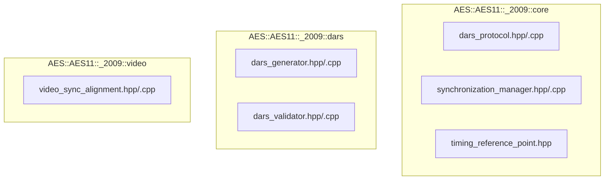

## C4 Level 4: Code-level Sketch (Indicative)

```mermaid
graph TB
    subgraph AES::AES11::_2009::core
      A[dars_protocol.hpp/.cpp]
      B[synchronization_manager.hpp/.cpp]
      C[timing_reference_point.hpp]
    end
    subgraph AES::AES11::_2009::dars
      D[dars_generator.hpp/.cpp]
      E[dars_validator.hpp/.cpp]
    end
    subgraph AES::AES11::_2009::video
      F[video_sync_alignment.hpp/.cpp]
    end
```

Note: Names are illustrative and follow repository naming conventions without introducing hardware-specific code in the standards namespace.
